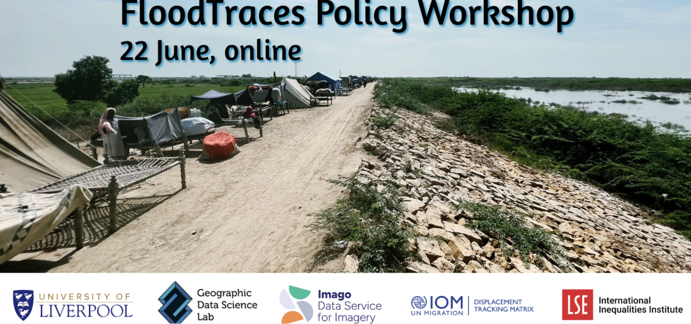

Here is a selection of training sessions I have held and events I have organised:

## Spatial Data Science Workshop
*Training Session — Belfast, May 12th, RSAI-BIS conference, University of Belfast*

**Website:** [https://imago-sdruk.github.io/Imago_training/](https://imago-sdruk.github.io/Imago_training/)

This hands-on workshop introduces participants to smart data products derived from satellite imagery and demonstrates how they can be applied to address pressing social and environmental challenges. Participants learn how complex Earth observation data can be transformed into accessible, analysis-ready resources that support practical spatial thinking and evidence-based decision-making.

Using data products from Imago: Data Service for Imagery, the workshop provides a guided, practical learning experience built around reproducible geospatial workflows. Attendees work directly with real-world datasets, exploring how imagery-derived indicators can be integrated with socioeconomic measures to investigate spatial inequalities and inform policy-relevant insights. By connecting technical geospatial methods with real societal outcomes, the session emphasises the role of GIS in driving meaningful progress for communities and environments.

Participants load spatial boundaries, merge satellite-derived indicators with deprivation metrics, generate summary statistics, and create maps that reveal significant spatial patterns. Accessible statistical techniques—including correlation, regression, and hotspot analysis—are introduced to support robust interpretation, alongside guided discussion on uncertainty, confounding factors, and the limits of causal inference.

Designed for participants with varied technical backgrounds, the workshop welcomes those new to Earth observation as well as users experienced with GIS or programming environments such as R or Python. Emphasis is placed on transferable skills, reproducibility, and analytical confidence so that attendees can adapt the workflow to their own research, teaching, or applied projects.

---

## FloodTraces Policy Workshop and Hackathon
*Event Organised*

**Website:** [https://pietrostefani.github.io/floodtraces-hack/](https://pietrostefani.github.io/floodtraces-hack/)

**About FloodTraces**  
The global challenge of internal displacement, exacerbated by climate-induced natural hazards, demands more timely and granular data than traditional survey methods alone can provide. In 2024, floods affected an estimated 40 million people worldwide — making them the most common disaster type globally — yet decision-makers in the critical first days after an event often face a near-total absence of reliable displacement figures.

FloodTraces addresses this gap by developing a replicable data pipeline that integrates digital trace data — GPS mobility records, social media signals, satellite imagery, and Cloudflare connectivity estimates — with traditional sources such as IOM’s Displacement Tracking Matrix surveys. The goal is not to replace established methods, but to triangulate and augment them: producing estimates that are faster, spatially finer, and available earlier than field surveys alone can deliver.

**About the Workshop**  
The FloodTraces Policy Workshop is a high-level dialogue with representatives from FCDO, IOM Displacement Tracking Matrix, NGOs, and partner organisations. The day centres on presenting the Colombia and Indonesia Digital Traces Situation Reports, gathering structured feedback on their usefulness and adoption potential, and surfacing the wider data landscape for flood response.

The event runs across three days, combining a senior policy workshop on Day 1 with a two-day hackathon on Days 2–3. The Policy Workshop will be hybrid; please note that we are only accepting registrations for Day 1 virtual attendees now.

---

## Can We Tackle Climate Change Without Deepening Inequality?
*LSE Festival Event 2026*

**Website:** [https://www.lse.ac.uk/events/lse-festival/2026/can-we-tackle-climate-change-without-deepening-inequality](https://www.lse.ac.uk/events/lse-festival/2026/can-we-tackle-climate-change-without-deepening-inequality)

A discussion exploring the intersection of climate action and social equality, examining policies and approaches to ensure that the transition to a greener economy does not leave vulnerable populations behind.
